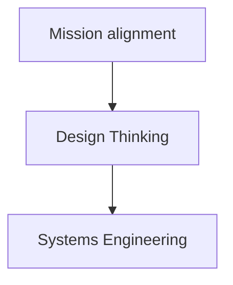

# ProST: Processes for Systems Thinking

ProST is a open-source, collaborative, modeled process standard for systems thinking.
Systems thinking entails processes for systems engineering, design thinking, and mission alignment.
## Systems thinking
Systems thinking is to think of everything as a system, part of a system, made up of systems.
This opens three questions:
- What kind of system am I? -> Simple, Complicated, Complex, Chaotic
- What is my environment?
- What are my systems? -> Artifacts, Processes, People

### Mission alignment
### Design Thinking
### Systems Engineering

