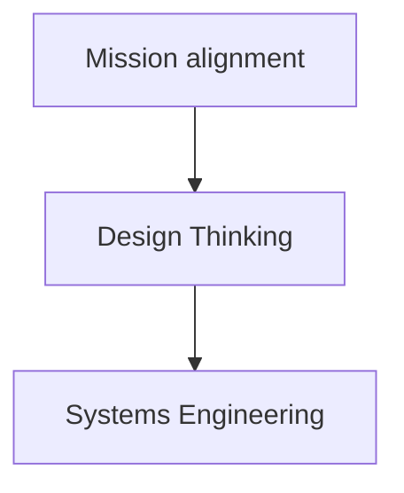

# ProST: Processes for Systems Thinking

ProST is a open-source, collaborative, modeled process standard for systems thinking.
Systems thinking is to think of everything as a system, part of a system, made up of systems.
In the context of this standard, the system is the process itself, as part of a system of systems called development.
It establishes process sub-systems, each rooted in an actual documented development need.
These sub-processes integrate systems engineering, design thinking and management methods based on their purposes.
This process system is modelled in order to achieve 

This opens three questions:
- What kind of system am I? -> Simple, Complicated, Complex, Chaotic
- What is my environment?
- What are my systems? -> Artifacts, Processes, People

### Types of systems

### Mission alignment
How to we organize our efforts to best achieve our mission?
- Agile methodologies
- Waterfall development

### Design Thinking
How do we make sure we have the right design?
- Problem space
- Solution space

### Systems Engineering
How do we model the system?
- V-Model

## Engage with ProST
- Public model
- Papyrus with SysML

## Contribute to ProST
- GitHub

