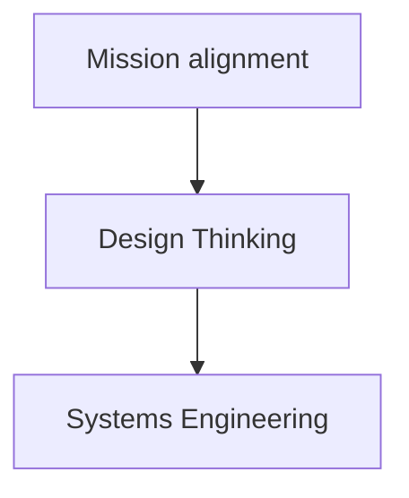

# ProST: Processes for Systems Thinking

ProST is a open-source, collaborative, modeled process standard for systems thinking.
Systems thinking entails processes for systems engineering, design thinking, and mission alignment.

- Systems thinking
    - Mission alignment
    - Design Thinking
    - Systems Engineering

